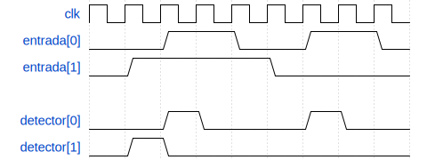

# Detector de Borda

Este laboratório tem como objetivo apresentar o conceito de registradores e de sinais síncronos. Esse tipo de sinal é atualizado num pulso de relógio e mantém o seu valor até o próximo pulso. Um circuito com regitradores será utilizado para detectar se houve uma borda de subida nos sinais de entrada.

Esse tipo de circuito pode ser útil em diversas situações. Alguns chips, por exemplo, podem utilizar uma borda de subida de um sinal como marca de inicío de comunicação.

## Comportamento do detector

O detector de borda sobe para nível alto quando ele nota que o sinal monitorado muda seu valor de '0' para '1'. Depois da borda, ele volta para zero. Veja na imagem abaixo o comportamento de dois detectores de borda, cada um monitorando o seu sinal correspondente.

> O detector deve utilizar um circuito sequencial, ou seja, é necessário usar o tipo `reg` para alguns sinais.

Como pode ser visto na imagem, os sinais de entrada e os sinais de detecção devem ser agrupados como um vetor de 2 bits.

> Lembre-se de utilizar um bloco `always` para poder criar comportamento síncrono em seu circuito.

Quando o sinal de reset fica em nível alto, os registradores devem ser zerados. Use reset assíncrono (@ posedge rst) no bloco always.

## Execução da atividade

Siga o modelo de módulo já fornecido e utilize o testbench e scripts de execução para sua verificação. Em seguida, implemente o circuito da calculadora de acordo com as especificações. Se necessário, crie outros testes para auxiliar na verificação do circuito.

Uma vez que estiver satisfeito com o circuito, execute o script de testes com `./run-all.sh`. Serão feitos 10 testes: cada um deles mostrará na tela `ERRO` em caso de falha ou `OK` em caso de sucesso.

## Entrega

Para entregar o projeto, basta fazer um *commit* no repositório do GitHub. O GitHub Classroom já está configurado para verificar a entrega e atribuir a nota dos testes automaticamente.

> Os testes do GitHub estão embutidos nos arquivos do laboratório. Se quiser saber mais sobre eles, veja o script de correção 'run.sh' do repositório do GitHub. Não altere os arquivos de correção!